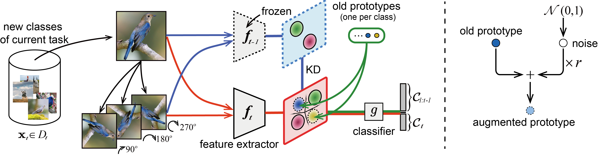

## PASS - Official PyTorch Implementation


### [CVPR2021 Oral] Prototype Augmentation and Self-Supervision for Incremental Learning
Fei Zhu, Xu-Yao Zhang, Chuang Wang,  Fei Yin, Cheng-Lin Liu<br>
[Paper](https://openaccess.thecvf.com/content/CVPR2021/papers/Zhu_Prototype_Augmentation_and_Self-Supervision_for_Incremental_Learning_CVPR_2021_paper.pdf)
### Usage 
run `main.py`.

## Citation 
```
@InProceedings{Zhu_2021_CVPR,
    author    = {Zhu, Fei and Zhang, Xu-Yao and Wang, Chuang and Yin, Fei and Liu, Cheng-Lin},
    title     = {Prototype Augmentation and Self-Supervision for Incremental Learning},
    booktitle = {Proceedings of the IEEE/CVF Conference on Computer Vision and Pattern Recognition (CVPR)},
    month     = {June},
    year      = {2021},
    pages     = {5871-5880}
}
```

## Reference
Our implementation uses the source code from the following repository:
<https://github.com/DRSAD/iCaRL>
